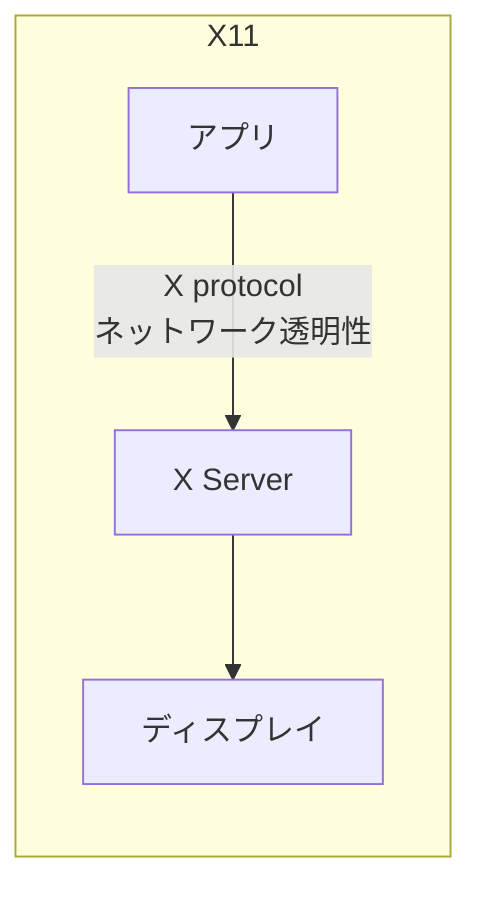
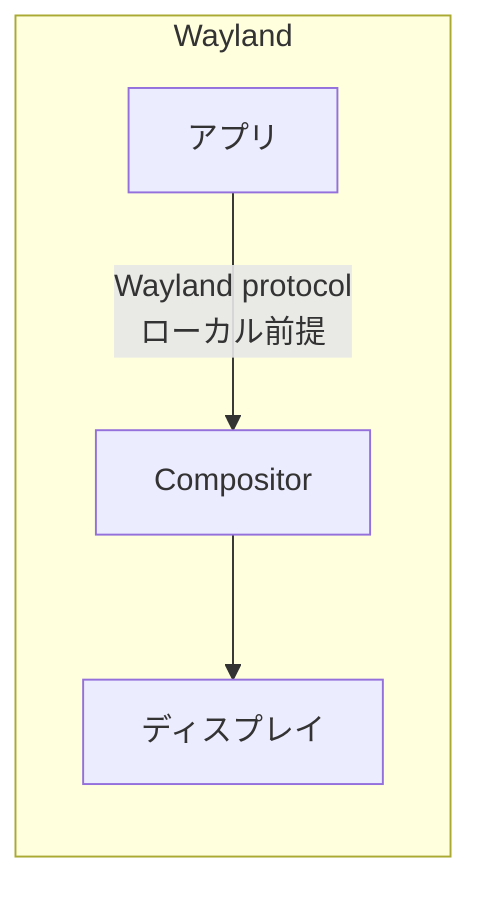

よ〜んです。

Amazon Linux 2023 で Amazon DCV を使ってリモートデスクトップ環境を作ろうとすると、まずデスクトップ環境が必要になるんですよね。で、GNOME を入れてみたらAmazon DCVではWaylandに対応していなかったので、X11とWaylandを整理してみようと思います。

<blockquote class="twitter-tweet"><p lang="ja" dir="ltr">X Window System がなんで X11 なのか気になって、k8s とか o11y みたいなやつかと思ったけど、よく数えたら12文字だった。<br><br>普通にバージョン11だったという</p>&mdash; よ〜ん (@Tesla_yoon) <a href="https://twitter.com/Tesla_yoon/status/2051594611735634112?ref_src=twsrc%5Etfw">May 5, 2026</a></blockquote> <script async src="https://platform.twitter.com/widgets.js" charset="utf-8"></script>

## AL2023 に GNOME をインストールする

[公式ドキュメント](https://docs.aws.amazon.com/linux/al2023/ug/installing-gnome-al2023.html)の手順はシンプルです。

t4g.small とか Lightsail でやろうとして OOM した人いると思います（二敗）。

### インストール

```bash
sudo dnf groupinstall "Desktop" -y
```

GNOME を入れただけでは特に意味がないので、リモートアクセスには **[Amazon DCV](https://aws.amazon.com/jp/hpc/dcv/)** を使います。AWS 上なら無料です。

## バージョンチェック

2026/05/04 時点の情報となります。

2025年始リリースのバージョンですね

```bash
$ gnome-shell --version
GNOME Shell 47.3
```

GDM（ログインマネージャー）の設定も確認してみます。

```bash
$ cat /etc/gdm/custom.conf
# GDM configuration storage

[daemon]
# Uncomment the line below to force the login screen to use Xorg
#WaylandEnable=false
...
```

`WaylandEnable=false` がコメントアウトされています。つまり **Wayland が有効な状態**です。

## X11 と Wayland、何が違うのか

### X11（X Window System）

アプリケーションが X protocol を使って表示先の X server に描画や入力イベントの処理を依頼する設計。この通信はネットワーク越しにも転送できるため、SSH の X11 forwarding（`ssh -X`）でリモートアプリを手元の画面に表示できます。
XQuartz などで Mac から Linux GUI を使った経験がある人もいると思います。




### Wayland

X11 の後継プロトコル。X11 の複雑さを整理して、**ローカル描画に最適化**した設計になっているようです。

[Wayland](https://wayland.freedesktop.org/)



## Amazon DCV を使うなら Wayland を無効化する必要がある

**Amazon DCV は Wayland プロトコルに対応していません**。

AL2023にインストールされるGNOMEはデフォルトで Wayland が有効になっているので、そのまま DCV をセットアップしても動きません。

[公式ドキュメント](https://docs.aws.amazon.com/ja_jp/dcv/latest/adminguide/setting-up-installing-linux-prereq.html#linux-prereq-wayland)にも明記されていて、DCV を使う場合は事前に Wayland を無効化する必要があります。

[Linux Amazon DCV サーバーの前提条件 - Amazon DCV](https://docs.aws.amazon.com/ja_jp/dcv/latest/adminguide/setting-up-installing-linux-prereq.html#linux-prereq-wayland)

## まとめ

X11 はワークステーション時代には素晴らしい設計だったと思いますし。リモートマシンで動いてるアプリを手元に表示できるなんて、画期的だったと思います。

一方で、今はクライアント性能も上がって、描画や合成もローカルで完結させるのが普通になりました。GNOME も Wayland への移行を加速させていますし、X11 が使えなくなる日は確実に近づいてます。

Wayland はそのあたりを現代向けに整理した設計なんですが、Amazon DCV のようなリモートデスクトップ用途ではまだ X11 が前提となっている部分が残っています。Amazon DCV の Wayland 対応を待ちたいですね〜

ではでは〜
