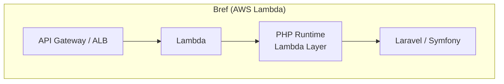

個人的にBrefをめっちゃ使っているよ〜んです。

2026年2月に [Bref 3.0](https://bref.sh/news/03-bref-3.0) がリリースされていました。

先日 [Bref と FrankenPHP を比較する記事](/posts/bref-vs-frankenphp/) を書いているときに気づいたんですが、心の奥底から待っていました...！！！

何が嬉しいかって、**Amazon Linux 2 の EOS に間に合った** ことです。

AL2 の EOS は元々 2025年6月30日だったんですが、1年延長されて 2026年6月30日になりました。
延長がなかったら結構やばかったんですよね…。とはいえ延長されたおかげで Bref 3.0 が余裕を持って出てきてくれたので、助かりました。

## Brefとは

[先日の記事](/posts/bref-vs-frankenphp/)から引っ張ってきています

[Bref](https://bref.sh/) は PHP を AWS Lambda で動かすためのオープンソースツール。Composer パッケージとして提供されていて、Lambda 用の PHP ランタイムを Lambda Layer として配布しています。

- AWS Lambda 上で PHP を実行するカスタムランタイム
- serverless CLIやAWS CDK、AWS SAMでデプロイ
- Laravel / Symfony との統合あり
- SQS、EventBridge などの AWS サービスとネイティブ連携



## Bref 3.0 で何が変わったのか

変更点の全体像は [公式のリリースノート](https://bref.sh/news/03-bref-3.0) を見てもらうのが早いですが、ざっくりまとめるとこんな感じです。

- **AL2023 ベースに移行**
	- Bref 3.0 にアップグレードするだけで自動的に AL2023 になる
- **レイヤーサイズ 24% 削減**
	- コールドスタートがtちょっと改善される
- **PHP 8.5 に対応**
- **Redis 拡張がビルトイン**
- **PostgreSQL PDO がデフォルト有効**
- **CloudWatch ログの改善**
	- →これが個人的に嬉しい

詳細やアップグレード手順は [v3 アップグレードガイド](https://bref.sh/docs/upgrading/v3) を参照してください。

## CloudWatch ログが見やすくなった

個人的に一番嬉しかったのがこれです。

Monolog フォーマッターがデフォルト有効になって、ログが構造がJSONで出力されるようになりました。

これだけだと「ふ〜ん」って感じかもしれないですが、一番ありがたいのは **例外のスタックトレースが1つの JSON オブジェクトにまとまる** ところです。

実際に個人的に使ってるホームシステムのBrefのバージョンをアップグレードしてみました。

### Before（v2）
```bash
[2026-05-07 01:15:30] production.INFO: GET / 200 1054ms
```

### After（v3）
```bash
INFO GET / 200 1105ms
{
	"message": "GET / 200 1105ms",
	"level": "INFO"
}
```

今まで CloudWatch でスタックトレースを見ようとすると、1行ごとに別のログレコードに分かれてて、めちゃくちゃ追いづらかったんですよね…。CloudWatch Logs Insights でフィルタリングするときも、ログレベルや例外クラスで絞れるようになるので、運用がだいぶ楽になりそうです。
## まとめ

元々のAL2のEOSが1年延長されなかったら、Bref 2.x のまま AL2 がEOSになるところだったので、正直ヒヤヒヤしていました。結果的にちゃんと間に合ってくれたので、あとは `composer update` してデプロイするだけですね。

ベースイメージのアップグレード以外にもCloudWatch ログの改善など嬉しい機能追加がありました。

開発者の皆様に感謝です🙏

EOS前にサクッとアップグレードしていきましょう、ではでは〜
