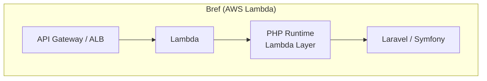
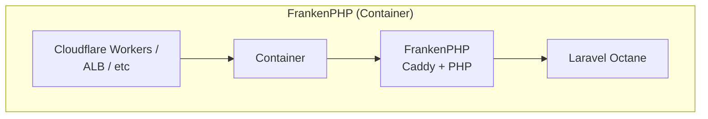

よ〜んです。

先日、[関西 PHP 勉強会](https://phpkansai.connpass.com/event/388908/)で「[PHPer、Cloudflare に引っ越す](https://speakerdeck.com/suguruooki/phper-cloudflare-niyin-tuyue-su)」という登壇を拝聴しました。

FrankenPHP + Cloudflare Containers で Laravel が世界 330 都市にデプロイできる、という話で、聞きながら思ったのが「Bref も似たようなことやってなかったっけ？」と。

PHP をサーバーレスで動かすという目的は同じなのに、アプローチが全然違う。じゃあどっちがどういうケースに向いてるのか、気になったのでまとめます。

## Bref

[Bref](https://bref.sh/) は PHP を AWS Lambda で動かすためのオープンソースツール。Composer パッケージとして提供されていて、Lambda 用の PHP ランタイムを Lambda Layer として配布しています。

- AWS Lambda 上で PHP を実行するカスタムランタイム
- serverless CLIやAWS CDK、AWS SAMでデプロイ
- Laravel / Symfony との統合あり
- SQS、EventBridge などの AWS サービスとネイティブ連携

## FrankenPHP

[FrankenPHP](https://frankenphp.dev/) は Go 製の Web サーバー [Caddy](https://caddyserver.com/) に PHP を直接組み込んだアプリケーションサーバー。**Worker モードで PHP プロセスをメモリに常駐させることで、リクエストごとのブートストラップを省略できます。**

- Caddy ベースの PHP アプリケーションサーバー
- Worker モード = Laravel Octane 相当のパフォーマンス
- Docker コンテナとしても動く
- Cloudflare Containers、ECS、Kubernetes など実行環境を選ばない(素晴ら)

## Bref vs FrankenPHP

| 観点 | Bref | FrankenPHP |
| - | - | - |
| 実行基盤 | AWS Lambda | Docker コンテナ（CF Containers / ECS / K8s） |
| コールドスタート | あり | なし（プロセス常駐） |
| スケーリング | 自動（同時実行数ベース）| 自動（コンテナオーケストレーター依存）|
| 最大実行時間 | 15 分 | 制限なし（実行環境依存） |
| リクエストサイズ上限 | ~6MB（API Gateway）/ ~1MB（Function URL） | 実質無制限 |
| ファイルシステム | 読み取り専用（`/tmp` のみ書き込み可） | 読み書き可能 |
| PHP 拡張 | Lambda Layer に含まれるもの or カスタムレイヤー | Dockerfile で自由に追加 |
| デプロイ先 | AWS のみ | どこでも（Cloudflare / AWS ）|
| 課金モデル | リクエスト数 + 実行時間 | コンテナ稼働時間 |
| ローカル開発 | Docker | `frankenphp php-server` / Docker |

### Bref のメリット・デメリット

#### メリット

- **ゼロ運用**: サーバー管理が完全に不要。スケーリングも AWS が勝手にやってくれる
- **従量課金**: トラフィックが少ないときはほぼ無料
- **AWS エコシステムとの親和性**: SQS、EventBridge、DynamoDBなどとネイティブ連携

#### デメリット

- **コールドスタート**: 長時間呼び出されなかった時など、ほんの数秒待つ必要が生まれる
- **実行時間制限**: 15 分の壁がある。長時間バッチは Step Functions で分割するか、ECS に逃がす必要がある
- **リクエストサイズ制限**: ファイルアップロードは S3 presigned URL に逃がす設計が必要
- **ロックイン**: Lambda 前提なので他クラウドへの移行は不可能だが、とはいえ知れてる。

### FrankenPHP のメリット・デメリット

#### メリット

- **コールドスタートなし**: Worker モードで PHP がメモリ常駐。レスポンスが安定して早い
- **PHP 拡張が自由**: Dockerfile に `install-php-extensions` で入れられる
- **可搬性**: コンテナなのでどこでも動く。Cloudflare Containers でも ECS でも GKE でも
- **WebSocket / リアルタイム**: Laravel Reverb がそのまま動く
- **ファイルシステム制約なし**: 一時ファイルの書き込みも自由

#### デメリット

- **コンテナ管理が必要**: ECS なり Kubernetes なり、コンテナオーケストレーターの知識が最低限
- **スケーリング設計**: 自動スケーリングの設定は自分でやる必要がある（Cloudflare Containers は楽そうですけど）
- **固定コスト**: トラフィックがゼロでもコンテナが起動してる分の課金は発生する
- **メモリリーク**: Worker モードは PHP プロセスが長時間生きるので、メモリリークに気をつける必要がありそう

## まとめ

Bref と FrankenPHP、どちらも「PHP をモダンなインフラで動かす」という同じベクトルを向いていますが、Bref は AWS Lambda のエコシステムに乗っかって、サーバーレスの恩恵を最大限受ける方向。FrankenPHP はコンテナの柔軟性を活かして、どこでも高速に動かす方向。というようにアプローチが全然違うのが面白いですね。

どっちが正解というわけじゃなくて、ワークロードと制約に合わせて選ぶのが大事かなと思いました。

とはいえ、最初に挙げさせていただいた[登壇](https://speakerdeck.com/suguruooki/phper-cloudflare-niyin-tuyue-su)を見て、「めっちゃ面白い」と思いましたし、私もAWSエンジニアとして、Lambda@Edgeで無理やり PHP を動かしてみよかなと思います。Bref とも FrankenPHP とも違う第三の選択肢(？)を使い、AWSのエッジコンピューティングで PHP がどこまで戦えるのか検証してみようと思います。

でわでは
