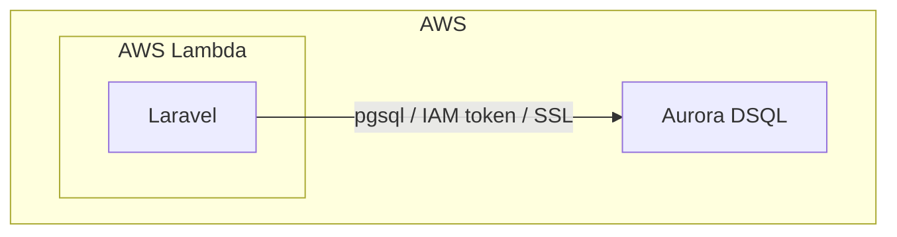

よ〜んです、Aurora DSQL には無料利用枠があるらしいので俄然触ってみたくなりました。

2024年のre:Inventで発表されて、触ってみたいなーとか思ってたら一年以上経ってたりしました。

最初に気になったのは、「どうやって接続を張るんだ」という点です。

## Aurora DSQL とは

Aurora DSQL は、`AWS re:Invent 2024` でプレビュー発表されたサーバーレスな分散 SQL データベースです。その後、2025年5月27日にGAされました。

PostgreSQL 互換をうたっていて、PostgreSQL の接続プロトコルやドライバを使えるのが特徴です。

ただ、ここでいう PostgreSQL 互換は、色々ややこしい感じで、完全に互換という訳ではありません。公式ドキュメントにも [unsupported features](https://docs.aws.amazon.com/aurora-dsql/latest/userguide/working-with-postgresql-compatibility-migration-guide.html) がまとまっていて、シーケンス、外部キー制約、テンポラリテーブル、トリガー、パーティション、PL/pgSQL、各種 PostgreSQL 拡張など、使えない機能があります。

[Introducing Amazon Aurora DSQL | AWS Database Blog](https://aws.amazon.com/blogs/database/introducing-amazon-aurora-dsql/)

[Amazon Aurora DSQL is now generally available | AWS News Blog](https://aws.amazon.com/blogs/aws/amazon-aurora-dsql-is-now-generally-available/)

[Unsupported PostgreSQL features in Aurora DSQL | AWS Docs](https://docs.aws.amazon.com/aurora-dsql/latest/userguide/working-with-postgresql-compatibility-unsupported-features.html)

[Use the PostgreSQL interactive terminal (psql) to access Aurora DSQL | AWS Docs](https://docs.aws.amazon.com/aurora-dsql/latest/userguide/accessing-psql.html)

## 今回の検証

今回は、Laravel を Lambda 上で動かしたまま、Aurora DSQL に素直につなげられるかを見ていきます。ざっくりした構成は次の通りです。



検証の焦点は次の 3 点です。

- Lambda 上の Laravel から `pdo_pgsql` 経由で Aurora DSQL にどうやって接続するか
- IAM 認証トークンを Laravel の接続設定に自然に差し込めるか
- Eloquent の恩恵を受けれるか

### 実装

#### 接続設定を追加する

まず `config/database.php` に `dsql` 接続を追加しました。ドライバは `pgsql` のままですが、Aurora DSQL 向けに `sslmode=require`、`region`、`occ_max_retries` まで含めて定義しています。

```php
'dsql' => [
    'driver' => 'pgsql',
    'host' => env('DSQL_ENDPOINT'),
    'port' => env('DSQL_PORT', '5432'),
    'database' => env('DSQL_DATABASE', 'postgres'),
    'username' => env('DSQL_USERNAME', 'admin'),
    'password' => '',
    'charset' => 'utf8',
    'prefix' => '',
    'prefix_indexes' => true,
    'search_path' => 'public',
    'sslmode' => 'require',
    'region' => env('DSQL_REGION', 'us-east-1'),
    'occ_max_retries' => env('DSQL_OCC_MAX_RETRIES', 3),
],
```
ポイントは`password`は固定値ではなく、次ので動的に差し込みます。

#### IAM 認証トークンを Laravel 側で動的生成する

Aurora DSQL では、接続時に IAM 認証トークンが必要です。

そこで `app/Services/DsqlTokenProvider.php` で、トークン生成とキャッシュをまとめています。

実装はかなり素直で、AWS SDK の `AuthTokenGenerator` を呼び出し、15 分有効のトークンを 14 分だけメモリに保持する形です。Lambda 実行環境の再利用と相性がいいので、このキャッシュはそのまま効きます。

```php
class DsqlTokenProvider
{
    private ?string $cachedToken = null;
    private ?int $cachedAt = null;

    private const TOKEN_TTL_SECONDS = 840;

    public function __invoke(): string
    {
        if ($this->isCacheValid()) {
            return $this->cachedToken;
        }

        $token = $this->generateToken();
        $this->cachedToken = $token;
        $this->cachedAt = $this->currentTime();

        return $token;
    }
}
```

Laravel 側で少し面倒なのは、このトークンをどこで接続設定へ差し込むかです。今回は `app/Providers/DsqlServiceProvider.php` で、起動時に `database.connections.dsql.password` を埋めています。

```php
public function boot(): void
{
    if (config('database.default') !== 'dsql') {
        return;
    }

    $provider = $this->app->make(DsqlTokenProvider::class);
    config(['database.connections.dsql.password' => $provider()]);
}
```

### `pdo_pgsql` を使える実行環境を用意する

Laravel のコードだけ直しても、実行環境で `pdo_pgsql` が使えなければ接続できません。`php/conf.d/pdo_pgsql.ini` で拡張を読み込み、CDK 側では pgsql 用レイヤーを Lambda に追加しています。

```ts
const pgsqlLayer = lambda.LayerVersion.fromLayerVersionArn(
  this, 'PgsqlLayer',
  `arn:aws:lambda:${this.region}:403367587399:layer:pgsql-php-84:6`,
);

const laravelServeFunction = new bref.PhpFpmFunction(this, 'LaravelServeFunction', {
  architecture: lambda.Architecture.X86_64,
  environment: {
    APP_ENV: 'production',
    LOG_CHANNEL: 'stderr',
    DB_CONNECTION: 'dsql',
  },
  phpVersion: '8.4',
});

laravelServeFunction.addLayers(pgsqlLayer);
```

今回の実装では、pgsql レイヤーの都合もあって PHP Lambda のアーキテクチャは `X86_64` にしています。(一敗)

## はまりどころ

### マイグレーションは Eloquent の恩恵をほぼ受けれない

ここはかなりつらかったです。

Aurora DSQL では `SERIAL` や `BIGSERIAL` が使用できません。

Laravel の `$table->id()` は普段かなり気軽に使えますが、今回は主キー戦略ごと見直す必要がありました。

今のリポジトリでは、DSQL 用 migration を別ファイルに切るのではなく、既存 migration の中で `isDsql()` 分岐を作り、DSQL のときだけ raw SQL を流す構成にしています。`database/migrations/xxxx_xx_xx_xxxxxx_create_users_table.php` だと、こういう形です。

```php
public function up(): void
{
    $pdo = DB::getPdo();
    $pdo->exec('CREATE TABLE IF NOT EXISTS users (
        id uuid DEFAULT gen_random_uuid() PRIMARY KEY,
        name varchar(255) NOT NULL,
        email varchar(255) NOT NULL UNIQUE,
        created_at timestamp(0) NULL,
        updated_at timestamp(0) NULL
    )');
}
```

Schema Builder に素直に乗らなかった理由はいくつかあったのですが、中でもSchema Builderの抽象化がDSQLの制約をことごとく踏み抜いていく感じが辛かったです。

### 楽観同時実行制御(OCC)前提でリトライを入れる

Aurora DSQL は**普通の PostgreSQL と同じ振る舞い**と思ってはダメです。

その一つが競合時の挙動です。実装では `SQLSTATE 40001` を検知して、リトライをミドルウェアで吸収しています。

`app/Http/Middleware/RetryOnOccConflict.php` では、最大リトライ回数を設定から読み、競合時には `DB::reconnect()` と指数バックオフとジッターを入れています。

```php
for ($attempt = 1; $attempt <= $maxRetries; $attempt++) {
    try {
        return $next($request);
    } catch (QueryException $e) {
        if (! $this->isSerializationFailure($e)) {
            throw $e;
        }

        DB::reconnect();

        if ($attempt < $maxRetries) {
            $delay = self::BASE_DELAY_MS * (2 ** ($attempt - 1));
            usleep(random_int($delay * 500, $delay * 1000));
        }
    }
}
```

このミドルウェアは `bootstrap/app.php` でグローバルに追加しています。(面倒なので)

## まとめ

Aurora DSQLはSQLを話すところだけ見ればポスグレなんですけど、ちょっと踏み込んだ実装やフレームワーク、ORMを使うとガンガンハマりましたね...

LaravelというかEloquentの機能を使わずに色々ゴニョる必要があります。

とはいえ、無料枠があるRDSなんてそうそうないので、個人開発では十分だなぁという感じです、勉強にもなりましたし。

個人的には、PHPにもいい感じのコネクターが出てくれると嬉しいな〜と思っていたり...

[Aurora DSQL が IAM 認可を簡素化する新しい Python、Node.js、JDBC 用のコネクタを発表](https://aws.amazon.com/jp/about-aws/whats-new/2025/11/aurora-dsql-python-node-js-jdbc-connectors-iam/)

ではでは
