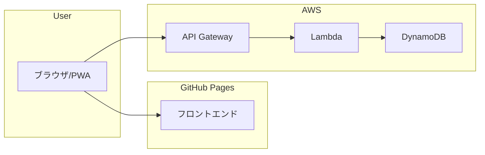

よ〜んです。

皆さんはPWAをご存知でしょうか？

おそらく、名前は知らないけど、使ってる人が多い技術なんじゃないかなと思っています。

かくいう私もその1人で、Twitter依存症すぎてアプリを消したが、結局ブラウザからTwitterを開いてってやってるうちに、毎回検索するのダルくなって、ホーム画面にブックマークを作ったところ、アプリみたいに使えたことがきっかけで知りました。

## PWA（Progressive Web Apps）とは

Webサイトをネイティブアプリのように使用できるようにする技術

[プログレッシブウェブアプリ (PWA) - MDN Web Docs - Mozilla](https://developer.mozilla.org/ja/docs/Web/Progressive_web_apps)

## 今回作るもの

[htmxとServer Sent Eventsを使ってカウンターを作る](/posts/creating-a-counter-with-htmx-and-server-sent-events/)で作成したものをベースに作ります。

キャッチアップの集大成というような感じになっております。

フロントはhtmxですが、バックエンドは普通のnode.jsです。

大体の構成としては以下、今回は後述する理由でフロントエンドはgithub pages、バックエンドはAWSにデプロイします。

## わかったこと

ネイティブのアプリケーションが不要なケースであれば、PWAで十分ではないかと思いました。

## 本題とは関係ない課題

ユーザーの数だけSSE用のLambdaが起動するので、チリツモ的な感じで事故りそうで怖い。

しかし、でご紹介した方法では、Stream Responseを返すことができないため

## まとめ

私がレジデントとして所属しているアニクラの1つに[アサクラ](https://huka-asa-anicla.webnode.jp/)というイベントがあります。

このイベントで使ってもらおうと思います。

以上、てすら・よ〜んでした。
