よ〜んです。

以前、[ALBなしでECSを使う構成](https://mu7889yoon.github.io/posts/alb-less-ecs/)を紹介しました。今回はその考え方を、Discord Gatewayへ常時接続するBotに当てはめます。

BotをAWSで動かすとき、一番安い選択肢はおそらくLightsail(EC2)です。次に、少し使い方に工夫がいるLambda MicroVMsという選択肢もあります。

そしてECS。普通に構成すると周辺リソースが増えて、Botを1つ動かすだけのスコープではオーバースペックになりそうに見えます。

今回は、Discord Gatewayへ常時接続するBotを題材に、ECSをまたALBなしで小さく動かす構成をご紹介します。

## Discord　Gateway Bot

Discord Botには、HTTPで受け取ったInteractionに応答するものや、Gatewayへ接続してイベントを受け取るものがあります。

今回扱うのは後者です。Botのプロセスが起動している間、Discord Gatewayへ接続し続けます。

つまりLambdaとは相性がよくありません。常時接続が必要なら、プロセスが動き続ける実行環境を用意する必要があります。

[Gateway - Documentation - Discord](https://docs.discord.com/developers/events/gateway)

## Lightsail

安い。IPv6専用なら月額3.50 USD、IPv4付きなら5 USDからです（[料金表](https://aws.amazon.com/lightsail/pricing/)）。

ただし、3.50 USDのIPv6専用プランではDiscord Botを動かせません。Gateway接続先の`gateway.discord.gg`にAAAAレコードがないため、IPv4付きプランが必要です。

Dockerで常時稼働できますが、更新はSSHや自前のCI/CDで行います。

EC2については費用が上がりやすいため、今回は候補から外します。

## Lambda MicroVMs

使うときだけ起動でき、実行時間を抑えられます。

ただし、最大8時間で、もちろん停止中はGatewayのイベントを受け取れません。

常時反応するBotには不向きで、起動用のスラッシュコマンドなどといった経路も必要です。

## ECS　/ Fargate

コンテナのデプロイを自動化しつつ、Botを常時稼働できます。

受信HTTPがないのでALBは不要。Public SubnetからPublic IPでGatewayへ接続します（[通信経路](https://docs.aws.amazon.com/AmazonECS/latest/developerguide/networking-outbound.html)）。

NAT Gatewayも置かず、Security Groupはインバウンドなし・外向きTCP 443のみです。

### GravitonとSpot

タスクはARM64で動かします。Fargate Spotは、通常のFargate料金より割引された料金でタスクを実行できる仕組みです。ECSではARM64とFARGATE_SPOTを組み合わせられます。

今回のタスク定義は0.25 vCPU、メモリ512 MiB、desired countは1です。Botの処理量に対して大きすぎないサイズから始めています。

ただし、Fargate Spotは中断される可能性があります。Botが切断から再接続できること、短い停止を許容できることが前提です。可用性が重要なBotの場合は普通に実行すればいいと思います。

## 今回の構成

お家システムではNode.jsのDiscord BotをECS Spot Serviceとして起動しています。

GitHub ActionsでコンテナイメージをECRへpushし、ECS Serviceへデプロイする感じです。

```mermaid
architecture-beta
    group aws(logos:aws)[AWS Cloud]

    service actions(logos:github)[GitHub Actions]
    service ecr(logos:aws-s3)[ECR] in aws
    service ecs(logos:aws-ecs)[ECS Service] in aws
    service task(logos:aws-ecs)[Fargate Spot Task] in aws
    service secretmgr(logos:aws-secrets-manager)[Secrets Manager] in aws
    service discord(internet)[Discord Gateway]

    actions:R --> L:ecr
    ecr:R --> L:ecs
    ecs:R --> L:task
    secretmgr:B --> T:task
    task:R --> L:discord
```

## まとめ

私の理解不足で、Discord Gateway Botを動かすためには、ALBが必要な気がしていて、今までLightsailで動かしていましたが、ECSでも安く小さく動かすことができました。

Botnおコードを更新の手間も含めて考えると結構楽になりましたね、あと、AIがコードを書く時代において人手でデプロイなんてしてたらたまったもんじゃないです。

お得に生きていきましょう、では〜
