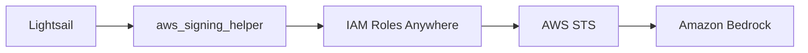

よ〜んです。

最近、Lightsail上で[Hermes Agent](https://hermes-agent.nousresearch.com/)を動かしています。

Hermes AgentからAmazon Bedrockを利用したいんですが、認証方法で少し悩みました。

EC2であればIAMロールをアタッチするだけで終わります。一方、LightsailにはIAMロールを付与する仕組みがありません。

そのため、一般的にはIAMユーザーを作成し、アクセスキーをサーバーへ配置することになります。

ということで今回は IAM Roles Anywhere を使って、LightsailからIAMアクセスキーなしでAmazon Bedrockを呼び出してみます。

## IAM Roles Anywhere

IAM Roles Anywhereは、AWSの外部で動作するワークロードからIAMロールを利用するためのサービスです。

X.509証明書を使って認証し、AWS STSから一時認証情報を取得します。

そのため、長期間利用できるIAMアクセスキーを保持する必要がありません。

オンプレミスや他クラウド向けのサービスという印象がありますが、IAMロールを付与できないLightsailでも利用できます。

[What is AWS Identity and Access Management Roles Anywhere? - IAM Roles Anywhere](https://docs.aws.amazon.com/ja_jp/rolesanywhere/latest/userguide/)

## 今回の構成

今回の構成はこんな感じです。



Hermes Agentは [aws_signing_helper](https://github.com/aws/rolesanywhere-credential-helper) を使って認証します。

IAM Roles AnywhereはAWS STSから一時認証情報を取得し、その認証情報を使ってAmazon Bedrockを呼び出します。

なので、LightsailにはIAMアクセスキーを配置しません。

今回検証した環境はこちらです。

```bash
$ uname -r

6.12.63+deb13-cloud-amd64
```

```bash
$ openssl -v

OpenSSL 3.5.6 7 Apr 2026 (Library: OpenSSL 3.5.6 7 Apr 2026)
```

Debian 13ではOpenSSLが最初からインストールされていたため、追加インストールは不要でした。

### なぜAWS Private CAを使わないのか

IAM Roles Anywhereのドキュメントを見ると、AWS Private CAを利用した構成が紹介されています。

もちろん本番運用を考えるとこちらが正攻法です。

ただ今回は、Lightsailが1台でHermes Agentだけという小さな環境ですし、Private CAは高すぎます。

## 認証局の作成

```bash
$ openssl genrsa -out ca.key 4096
```

続いてCA証明書を作成します。

今回は CA:TRUE が付与されるよう設定ファイルを作成しました。

```ini
[req]
distinguished_name = dn
x509_extensions = v3_ca
prompt = no

[dn]
C = JP
ST = Prefecture
L = Prefecture
O = Example
OU = Example
CN = Example

[v3_ca]
basicConstraints = critical, CA:TRUE
keyUsage = critical, keyCertSign, cRLSign
subjectKeyIdentifier = hash
authorityKeyIdentifier = keyid:always,issuer
```

```bash
$ openssl req \
  -x509 \
  -new \
  -sha256 \
  -key ca.key \
  -days 3650 \
  -config ca.cnf \
  -out ca.crt
```

```ini
Basic Constraints
    CA:TRUE
```

が必要であったり、色々制約があります。

[The IAM Roles Anywhere trust model - IAM Roles Anywhere](https://docs.aws.amazon.com/ja_jp/rolesanywhere/latest/userguide/trust-model.html#signature-verification)

## Lightsail用の証明書の作成

```bash
$ openssl genrsa -out lightsail.key 2048
```

[CSR](https://knowledge.digicert.com/jp/tutorials/how-to-create-csr)を作成し、

```bash
$ openssl req -new \
  -key lightsail.key \
  -out lightsail.csr
```

クライアント証明書用の拡張を定義します。

```ini
[leaf]
basicConstraints = critical, CA:FALSE
keyUsage = critical, digitalSignature
extendedKeyUsage = clientAuth
subjectKeyIdentifier = hash
authorityKeyIdentifier = keyid,issuer
```

認証局にCSRで署名します。

```bash
$ openssl x509 \
  -req \
  -in lightsail.csr \
  -CA ca.crt \
  -CAkey ca.key \
  -CAcreateserial \
  -days 3650 \
  -sha256 \
  -extfile leaf.cnf \
  -extensions leaf \
  -out lightsail.crt
```

作成後に、証明書チェーンを確認します。

```bash
$ openssl verify \
  -CAfile ca.crt \
  lightsail.crt

lightsail.crt: OK
```

## IAM Roles Anywhereの設定

今から、Trust Anchor, IAM Role, Profileの三つを作成していきます。


### Trust Anchor


CA証明書(ca.crt)をアップロードします。


### IAM Role

IAM Roleの作成です、といってもポリシーの方は結構どうでもよくて、信頼ポリシーについてのみ触れます。

```json
{
    "Version": "2012-10-17",
    "Statement": [
        {
            "Effect": "Allow",
            "Principal": {
                "Service": "rolesanywhere.amazonaws.com"
            },
            "Action": [
                "sts:AssumeRole",
                "sts:SetSourceIdentity",
                "sts:TagSession"
            ],
            "Condition": {
                "StringEquals": {
                    "aws:PrincipalTag/x509Subject/CN": "Example"
                },
                "ArnEquals": {
                    "aws:SourceArn": "arn:aws:rolesanywhere:ap-northeast-1:123456789012:trust-anchor/xxxxxxxx-xxxx-xxxx-xxxx-xxxxxxxxxxxx"
                }
            }
        }
    ]
}
```

最初は信頼ポリシーを単純に`rolesanywhere.amazonaws.com`だけ許可していましたが、`プリンシパルタグまたはソースIDを指定してください`という怒られが発生したので、

今回は証明書のCommon Nameを利用して

`aws:PrincipalTag/x509Subject/CN = Hermes-agents`

### Profile

最後にProfileを作成します。

ここで先ほど作成したIAM Roleを紐づけたりするだけです。以上

## aws_signing_helperの設定

Lightsailへaws_signing_helperのバイナリを配置し、`aws_signing_helper credential-process`を実行すると、一時認証情報が取得できます。

```bash
$ aws_signing_helper credential-process \
  --certificate ./lightsail.crt \
  --private-key ./lightsail.key \
  --trust-anchor-arn arn:aws:rolesanywhere:ap-northeast-1:123456789012:trust-anchor/xxxxxxxx-xxxx-xxxx-xxxx-xxxxxxxxxxxx \
  --profile-arn arn:aws:rolesanywhere:ap-northeast-1:123456789012:profile/xxxxxxxx-xxxx-xxxx-xxxx-xxxxxxxxxxxxx \
  --role-arn arn:aws:iam::123456789012:role/piyo-role

{
    "Version":1,
    "AccessKeyId":"HOGE",
    "SecretAccessKey":"FUGA","SessionToken":"PIYO","Expiration":"2026-07-10T03:36:21Z"
}
```


### AWS CLIの設定

`~/.aws/config`を以下みたいな感じで設定します。


```ini
[default]
region = ap-northeast-1
output = json
credential_process = /usr/local/bin/aws_signing_helper credential-process --certificate /opt/iam-roles-anywhere/lightsail.crt --private-key /opt/iam-roles-anywhere/lightsail.key --trust-anchor-arn arn:aws:rolesanywhere:ap-northeast-1:123456789012:trust-anchor/xxxxxxxx-xxxx-xxxx-xxxx-xxxxxxxxxxxx --profile-arn arn:aws:rolesanywhere:ap-northeast-1:123456789012:profile/xxxxxxxx-xxxx-xxxx-xxxx-xxxxxxxxxxxxx --role-arn arn:aws:iam::123456789012:role/piyo-role
```

これでAWS CLIもAWS SDKも自動的に一時認証情報を取得してくれます。

## 動作確認

### アクセスキー撲滅前

```bash
$ aws sts get-caller-identity

{
    "UserId": "HOGE",
    "Account": "123456789012",
    "Arn": "arn:aws:iam::123456789012:user/MantleApiKey"
}
```

### アクセスキー撲滅後


```bash
$ aws sts get-caller-identity

{
    "UserId": "HOGE",
    "Account": "123456789012",
    "Arn": "arn:aws:sts::123456789012:assumed-role/piyo-role/xxxxxxxxxxxxxxxxx"
}
```

## まとめ

今回はLightsailからアクセスキーを撲滅するために、IAM Roles Anywhereを使ってみました。

LightsailでもEC2のインスタンスロールに近い使い方ができるので、今まで「LightsailだからIAMアクセスキーを置くしかない」と思っていましたが、解決できました。

また、`credential_process` という仕組みも今回初めて知りました。認証情報の取得方法を差し替えられるので、IAM Roles Anywhere以外にもいろいろ応用できそうです。（何やろうか🤔）

Lightsailだけでなく、オンプレミスや他クラウドなど、IAMロールを直接付与できない環境からAWSサービスを利用する場合にも活躍しそうですね。

ではでは〜
