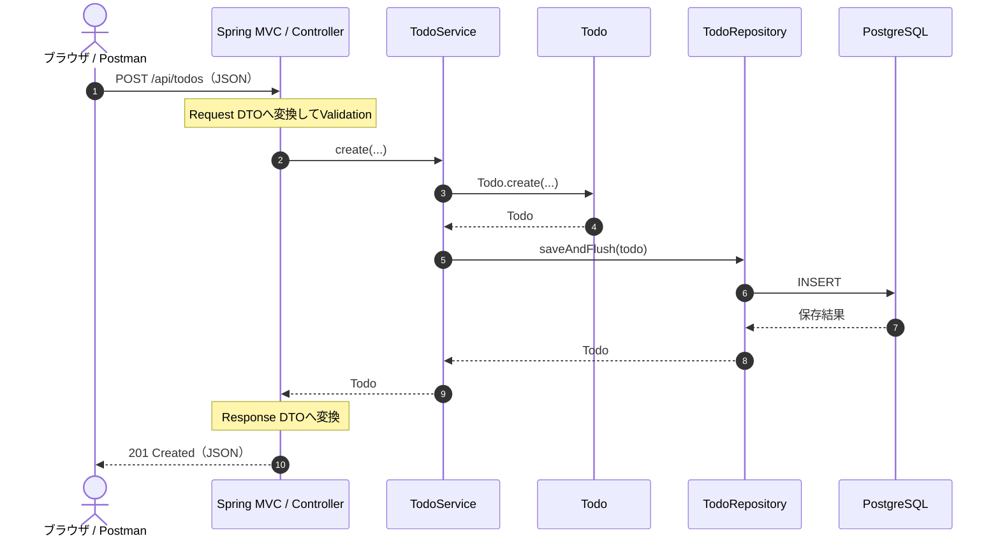
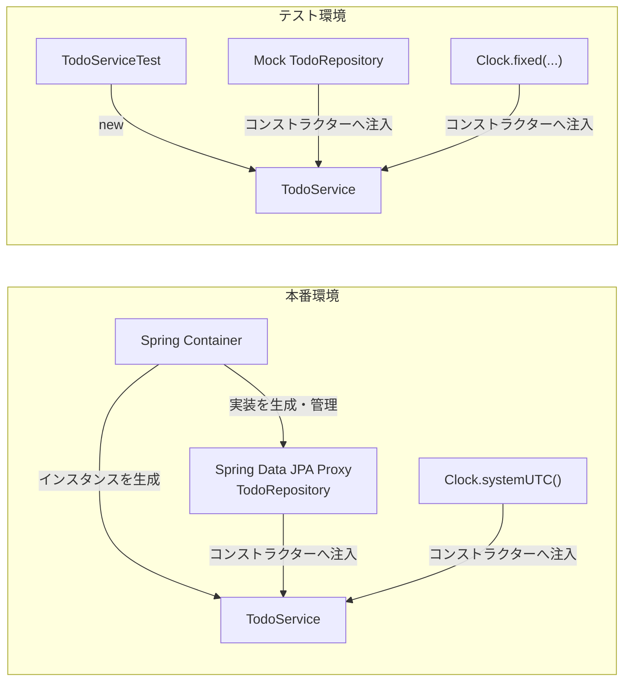

Spring BootをMaster Boot RecordとかGRUBの類だと思っていたよ〜んです。

Javaを書いたことはありませんが、まぁPHPみたいなクラス型の言語でしょ、という軽いノリで進めていきます。

よく聞くDIやレイヤードアーキテクチャがコード上で何をしているのかも読んでいきます。

## 環境構築

開発環境にはDocker Composeを使います。

やはり手こずるのが環境構築。初めての言語、初めてのフレームワークぐらい手でやった方がいいです。（辛面白いので）

とか思っていましたが、便利そうなWebツールがありました。

Spring Initializrです。

参考 [Spring Initializr](https://start.spring.io/)

今回の設定 [Spring Initializr](https://start.spring.io/#!type=maven-project&language=java&platformVersion=4.1.0&packaging=jar&configurationFileFormat=properties&jvmVersion=26&groupId=com.example&artifactId=todo&packageName=com.example.todo&dependencies=web,data-jpa,validation,postgresql,flyway,actuator,devtools)

ここら辺の開発者体験はいいですね。

### `pom.xml` is 何者なのか

`pom.xml`がパッケージ管理をしているっぽいですね。

可愛いファイル名とか思っていましたが、POMは **Project Object Model** の略でした、なかなかイカついすね。

JavaScriptでいう`package.json`に近い立ち位置ですが、依存関係だけでなくビルド方法なども含めてMavenがプロジェクトを管理するファイルということらしいです。

まっさらな状態から始める場合は、先にSpring Initializrで`pom.xml`、`mvnw`、`src/`などを生成し、その後にDocker環境を作るのが分かりやすそうです。

### 起動してみる

`app`ディレクトリで起動します。

```bash
docker compose up
```

最初にアクセスしたときは、Whitelabel Error Pageが出ました。


これはアプリケーションが落ちているのではなく、`/`に対応するControllerもHTMLもまだないための404でした。

Actuatorのヘルスチェックを見ると、Spring Boot自体は起動しています。


## Todoアプリの仕様

Webアプリケーション界のHello World、超シンプルなTodoアプリケーションを作ります。

Todoの登録、取得、更新、削除と、未完了・完了の切り替えができれば一旦完成とします。

APIはこの形です。

|Method|Path|用途|
|-|-|-|
|`POST`|`/api/todos`|Todoを登録する|
|`GET`|`/api/todos`|Todoを一覧表示する|
|`GET`|`/api/todos/{id}`|Todoを1件取得する|
|`PUT`|`/api/todos/{id}`|タイトルなどを更新する|
|`PATCH`|`/api/todos/{id}/status`|完了・未完了を切り替える|
|`DELETE`|`/api/todos/{id}`|Todoを削除する|

## レイヤードアーキテクチャで分ける

アーキテクチャは、あるあるのレイヤードアーキテクチャで組みます。（まぁClean Architectureが好みなのですが）

Todoを登録するときは、ざっくり次の順番で処理されます。



各レイヤーに責務を分けることで、ControllerへSQLを書いたり、EntityへHTTPレスポンスの都合を書いたりせずに済みます。

プロジェクトの主な構成は次のようになりました。

```text
src/
├── main/
│   ├── java/com/example/todo/
│   │   ├── TodoApplication.java
│   │   ├── config/ApplicationConfig.java
│   │   ├── controller/
│   │   │   ├── TodoController.java
│   │   │   ├── ApiExceptionHandler.java
│   │   │   └── dto/
│   │   ├── entity/
│   │   ├── repository/
│   │   └── service/
│   └── resources/
│       ├── application.properties
│       ├── db/migration/V1__create_todos.sql
│       └── static/index.html
└── test/java/com/example/todo/
```

`TodoApplication.java`を`com.example.todo`に置き、それ以下へControllerやServiceを置いています。`@SpringBootApplication`が付いたクラスのパッケージが、SpringがコンポーネントやEntityを探す基準になるようです。

参考 [Structuring Your Code :: Spring Boot](https://docs.spring.io/spring-boot/reference/using/structuring-your-code.html)

## 実装を読んでいく

気になったところだけ記事に載せていきます。

### ControllerとDTO

ブラウザから送ったJSONは`TodoController`が受け取り、`CreateTodoRequest`へ変換します。

```java
@NotBlank(message = "title is required")
@Size(max = 200, message = "title must be 200 characters or fewer")
String title
```

Javaの`record`は、値を運ぶクラスを短く書くための機能らしいです。ここではAPIから受け取る項目とValidationをまとめています。

JSONをEntityへ直接変換せずDTOで受けるため、利用者から`createdAt`などを勝手に指定されることもありません。

入力チェックはDTOとEntityとDBにありますが、それぞれ守っている境界が違います。

- DTOは外部入力を検証し、400レスポンスへつなげる
- EntityはHTTP以外から呼ばれても不正なTodoを作らせない
- DBはアプリケーションを経由しない書き込みも拒否する

ここは私が知ってるなんちゃってクリーンアーキテクチャと違うので、なんかモヤる。

参考 [Request Body :: Spring Framework](https://docs.spring.io/spring-framework/reference/web/webmvc/mvc-controller/ann-methods/requestbody.html)

### Serviceとトランザクション

Serviceは「Todoを作って保存する」というユースケースをまとめています。HTTPのステータスやJSONは知らず、Entityの作成とRepositoryへの保存を調整する役です。

`@Transactional`を付けると、Springのプロキシがメソッド呼び出しを包みます。正常ならコミット、例外ならロールバックする処理が、Serviceのコードとは別に差し込まれる感じです。

アノテーションが魔法でDBを操作していると思っていましたが、間にいるプロキシが頑張っていました。

参考 [Understanding the Spring Framework’s Declarative Transaction Implementation](https://docs.spring.io/spring-framework/reference/data-access/transaction/declarative/tx-decl-explained.html)

### Dependency Injection

Springでよく聞くDIはDependency Injection、依存性注入です。

`TodoService`はTodoを保存するために`TodoRepository`を、現在時刻を得るために`Clock`を必要とします。しかし、Service自身はそれらを`new`していません。

```java
public TodoService(TodoRepository repository, Clock clock) {
    this.repository = repository;
    this.clock = clock;
}
```

必要なものをコンストラクターの外から渡してもらっています。これが今回のDIです。



本番ではSpringがRepositoryとClockを渡します。テストではMockのRepositoryと固定したClockを渡します。`TodoService`自体は変わりません。

ここら辺はLaravelのテストコードを書くときにも使いますね。依存先をMockへ差し替えたり、現在時刻を固定したりする考え方は、SpringでもLaravelでも同じっぽいです。

もしServiceの中で`Instant.now()`を直接呼んでいたら、同じ時刻を期待するテストが難しくなります。DIはSpringらしい書き方というだけでなく、依存先を明示して交換できるようにする設計でした。

参考 [Dependencies and Configuration in Detail :: Spring Framework](https://docs.spring.io/spring-framework/reference/core/beans/dependencies/factory-collaborators.html)

### Entityとステート

`Todo`はJPAのEntityであると同時に、Todoの状態と振る舞いを持つクラスです。

Setterを何でも公開せず、完了・未完了の切り替えは`changeStatus`へまとめました。

```java
public void changeStatus(TodoStatus newStatus, Instant now) {
    Objects.requireNonNull(newStatus);
    Objects.requireNonNull(now);

    if (status == newStatus) {
        return;
    }

    status = newStatus;
    completedAt = newStatus == TodoStatus.COMPLETED ? now : null;
    updatedAt = now;
}
```

ControllerやServiceが`status`と`completedAt`を別々に書き換える設計だと、「状態は完了なのに完了日時がない」というTodoが生まれかねません。

状態と、それを変えるルールをEntityの中へまとめる理由がここで理解できました。

`@Version`も付けて楽観ロックを使っています。ただし、現在のAPIはクライアントからversionを受け取っていません。古い画面からの更新まで厳密に拒否するなら、versionをリクエストへ含めるか、HTTPの`ETag`と`If-Match`を使う必要がありそうです。

参考 [Version (Jakarta EE Platform API)](https://jakarta.ee/specifications/platform/11/apidocs/jakarta/persistence/version)

### Repository

Repositoryはめっちゃ薄いす。

```java
List<Todo> findAllByOrderByCreatedAtDesc();
List<Todo> findByStatusOrderByCreatedAtDesc(TodoStatus status);
```

`JpaRepository<Todo, UUID>`を継承すると、基本的な保存・検索・削除はSpring Data JPAが用意します。

さらに、`findByStatusOrderByCreatedAtDesc`というメソッド名から「statusで絞り込み、createdAtの降順で並べる」クエリまで作ってくれます。

メソッド名がSQLみたいになっていて面白いですが、条件が複雑になるとつらそうです。その場合は`@Query`などへ切り替えるらしいです。

参考 [JPA Query Methods :: Spring Data JPA](https://docs.spring.io/spring-data/jpa/reference/jpa/query-methods.html)

### FlywayとHibernateの役割

DBのテーブルは`V1__create_todos.sql`をFlywayが実行して作ります。

```properties
spring.jpa.hibernate.ddl-auto=validate
spring.flyway.enabled=true
```

FlywayがDB変更を担当し、HibernateはEntityとテーブルの対応が破綻していないか検証する役にしました。両方にテーブルを作らせない構成です。

SQLには`CHECK`制約も入れています。Entityと同じルールに見えますが、DBを直接操作されても不正な状態を保存させないためです。

参考 [Database Initialization :: Spring Boot](https://docs.spring.io/spring-boot/how-to/data-initialization.html)

## 動かしてみる


アクセスすると、CSSなしのTodo画面が表示されます。


Todoの登録、一覧、状態変更、削除まで動きました。

Spring BootがHTMLを配信し、そのJavaScriptから自分のAPIを呼ぶところまで一旦完成です。

## Java未経験エンジニアによる気になったポイント

### src/mainってフォルダをなぜ切るの？

イケてないルールではなく、Mavenの標準でした。

- `src/main/java`は本番用のJavaコード
- `src/main/resources`は設定、SQL、HTMLなどのリソース
- `src/test/java`はテストコード
- `target`はコンパイル結果や作成したjar

参考 [Introduction to the Standard Directory Layout – Maven](https://maven.apache.org/guides/introduction/introduction-to-the-standard-directory-layout.html)

### DTOの置き場所どこにすればええねん！

今回のDTOはHTTPリクエストとレスポンス専用なので、`controller/dto`へ置いてみました。

主流は`dto`を単体でディレクトリを切ることでした。

### importがまじで多い

多いです。Laravelとかでもまぁこうなるが、それにしても多いw

Javaではクラスがどのパッケージにあるのかを`import`で明示します。

エディタ側で整理を任せるので体験が悪いとかそういうのはないですが、多いなぁという感想です、

## まとめ

おそらく会社ごとに記法や設計規則がありそうなので、Java経験・未経験という括り自体、あんまり意味がなさそうな気がしました。

まぁ、でも触ってよかったなという感じです。

次はこれをPostmanからテストしてみます。
