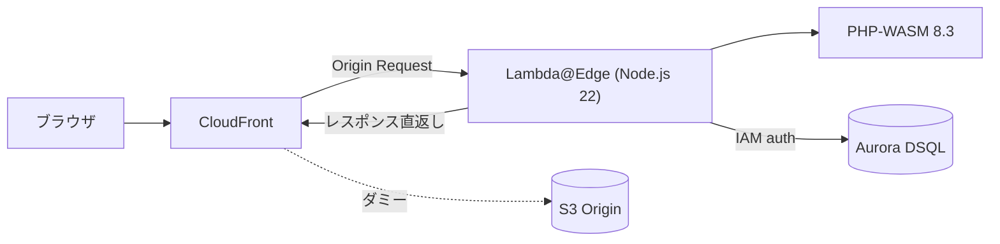
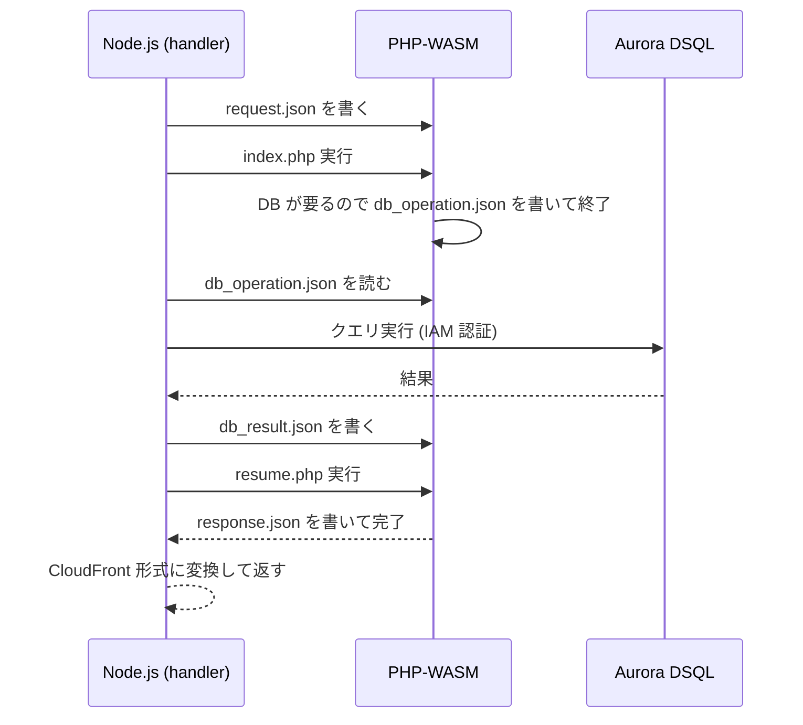

よ〜んです。

以前 [Bref vs FrankenPHP](https://mu7889yoon.github.io/posts/bref-vs-frankenphp/) という記事を書きまして、そのまとめで「Lambda@Edge で無理やり PHP を動かしてみよかな」と言っていたので、今回はその内容に取り組んでみます。

結論から言うとちゃんと動きました。ただ正攻法では無理で、いろいろ寄り道が必要だったんですよね…。今回はその記録です。

サンプルコードはこちら: [mu7889yoon/examples - laravel-wasm-on-lambda-edge](https://github.com/mu7889yoon/examples/tree/main/laravel-wasm-on-lambda-edge)

当初は Laravel を Lambda@Edge で動かそうとしていたのですが、まぁ制約が重なり無理でしたw

## Lambda@Edge とは

[Lambda@Edge](https://docs.aws.amazon.com/AmazonCloudFront/latest/DeveloperGuide/lambda-at-the-edge.html) は、CloudFront のエッジロケーション（世界各地の PoP）で Lambda 関数を実行できるサービスです。ユーザーに物理的に近い場所でコードが動くので、レスポンスの低レイテンシ化が期待できます。

CloudFront がリクエスト/レスポンスを処理する 4 つのタイミングで関数を差し込めます。

- Viewer Request: クライアントから CloudFront に届いた瞬間
- Origin Request: CloudFront がオリジンに問い合わせる直前
- Origin Response: オリジンから返ってきた直後
- Viewer Response: クライアントに返す直前

今回は Origin Request のタイミングで PHP を動かして、オリジンには一切触れずにレスポンスを返す「オリジンレス」な構成を組みます。

## どうやって Lambda@Edge で PHP を動かすのか

Bref が Lambda で PHP を動かせるのは、Lambda Layer でカスタムランタイムを配れるからです。ところが Lambda@Edge には[いくつかの制限](https://docs.aws.amazon.com/AmazonCloudFront/latest/DeveloperGuide/lambda-at-edge-function-restrictions.html)があって、この手が使えません。

- ランタイムは Node.js か Python のみ。カスタムランタイム不可
- Lambda Layer が使えない
- 環境変数が使えない
- パッケージサイズ制限が普通の Lambda より厳しい

つまり「PHP ランタイムを持ち込む」という Bref 方式が封じられています。

じゃあどうするか。PHP 自体を WebAssembly にコンパイルして、Node.js ランタイムの中で動かせばよくない？という発想です。これが今回使った [php-wasm](https://github.com/WordPress/wordpress-playground/tree/trunk/packages/php-wasm) です。[WordPress Playground](https://playground.wordpress.net/) でブラウザ上の PHP を動かしてるアレですね。

Bref とも FrankenPHP とも違う第三の選択肢、というのはこういうことでした。

## 作ったもの

とりあえず動く・動かせることを確認したかったので、題材はシンプルな掲示板にしました。投稿一覧と新規投稿だけのやつです。

### アーキテクチャ

ポイントは、オリジン（S3）に実体がないことです。CloudFront の Origin Request で Lambda@Edge が割り込んで、PHP-WASM がレスポンスをそのまま返してしまう「オリジンレス」な構成にしています。S3 バケットは置いてますが、ダミーで一度も触られません。



CDK 側の肝はこのあたり。Lambda@Edge は `EdgeFunction` で組んで、ビルド済みの `dist` ディレクトリをまるごと `Code.fromAsset` で渡します。メモリは 256MB にしてますが、正直 WASM ランタイムの初期化にどのくらい効いてるかはちょっとわかってないです。もう少しチューニングの余地ありそう。

```typescript
const edgeFn = new cloudfront.experimental.EdgeFunction(this, 'EdgeHandler', {
  runtime: lambda.Runtime.NODEJS_22_X,
  handler: 'handler.handler',
  code: lambda.Code.fromAsset(path.join(__dirname, '../../src/dist')),
  timeout: cdk.Duration.seconds(30),
  memorySize: 256,
});

this.distribution = new cloudfront.Distribution(this, 'Distribution', {
  defaultBehavior: {
    origin: origins.S3BucketOrigin.withOriginAccessControl(originBucket),
    edgeLambdas: [
      {
        functionVersion: edgeFn.currentVersion,
        eventType: cloudfront.LambdaEdgeEventType.ORIGIN_REQUEST,
        includeBody: true, // POST ボディを受け取るのに必須
      },
    ],
    viewerProtocolPolicy: cloudfront.ViewerProtocolPolicy.REDIRECT_TO_HTTPS,
    allowedMethods: cloudfront.AllowedMethods.ALLOW_ALL,
    cachePolicy: cloudfront.CachePolicy.CACHING_DISABLED,
  },
});
```

`includeBody`が`false`だと POST のボディが取れなくて、投稿フォームが死にます (一敗)

### WASM は DB に直接繋げない問題

ここが一番のハマりどころでした。

php-wasm はサンドボックスの中で動くので、ソケットを開いて Aurora DSQL に直接繋ぐ、みたいなことができません。PHP 側で `pg_connect` 的なことをやろうとしても無理なんですよね…。

そこで、DB アクセスは外側の Node.js に肩代わりさせることにしました。この発想は Claude Code に相談したら出してくれたもので、自分で思いついたわけではないです。PHP と Node.js のやり取りは、WASM の仮想ファイルシステム上に JSON ファイルを置いて橋渡しする。名付けてブリッジパターン（そのまんま）。めちゃくちゃ賢い。



要は、PHP は「DB 叩きたい」と書き置きして一旦実行を終え、Node.js が代わりにクエリを投げて、結果を置いてから `resume.php` で続きを再開する、という継続渡しっぽい動きです。Node.js 側のループはこんな感じになります。

```typescript
// index.php を実行（初回パス）
await bridge.runPhp('/app/index.php');

// DB 操作ブリッジループ: PHP が要求する限り繰り返す
let dbOp = await bridge.readDbOperation();
while (dbOp !== null) {
  const client = await getDbClient();
  const result =
    dbOp.action === 'query'
      ? await client.query(dbOp.sql, dbOp.params)
      : await client.execute(dbOp.sql, dbOp.params);

  await bridge.writeDbResult(result);
  await bridge.runPhp('/app/resume.php');

  dbOp = await bridge.readDbOperation();
}
```

PHP 側は普通に書けるのが地味に嬉しいポイントで、「DB 操作を要求して状態を保存」→「続きで結果を受け取る」だけ意識すればよいです。

```php
// 一覧表示: まず件数を取りにいく
request_db_operation('query', 'SELECT COUNT(*) as total FROM posts', [], [
    'phase' => 'list_count',
    'page' => $page,
    'limit' => $limit,
    'offset' => $offset,
]);
// ここで PHP の実行は一旦終わる。resume.php が続きをやる。
```

最初は「PHP から DB 直接いけるやろ」とタカをくくってたんですが、WASM のサンドボックスにきっちり阻まれました。ここに気づくまでが長かったです (アホ)。

### DB は Aurora DSQL

DB は Aurora DSQL を選びました。理由はだいたいこのへんです。

- サーバーレスなので、エッジのスパイクに合わせて勝手にスケールしてくれる
- IAM 認証トークンで繋げるので、パスワード管理が要らない
- 使った分だけ課金なので、掲示板程度のトラフィックならかなり🉐

接続は `@aws-sdk/dsql-signer` で認証トークンを生成して、`pg` (node-postgres) に食わせるだけです。Lambda@Edge は環境変数が使えないので、接続プールは最大 1 に絞って、コールドスタートを軽くする方向にしてます。

```typescript
const signer = new DsqlSigner({
  hostname: this.config.endpoint,
  region: this.config.region,
});
const token = await signer.getDbConnectAdminAuthToken();

this.pool = new Pool({
  host: this.config.endpoint,
  port: 5432,
  user: 'admin',
  password: token,
  database: this.config.database,
  ssl: { rejectUnauthorized: true },
  max: 1, // Lambda@Edge のコールドスタート最適化
});
```

ちなみに環境変数が使えない縛りのせいで、DSQL のエンドポイントはハードコードしてます。CDK でデプロイした後に実エンドポイントへ書き換える、という地味に面倒な運用になってます。ここは正直イケてないので、もうちょっとうまいやり方を探したいところ。

## その他のハマりどころ

### Origin Request じゃないとサイズが足りない

Lambda@Edge はイベントタイプによってコードサイズの上限が違って、Viewer 系はかなり小さめ、Origin 系の方が大きめに取れます。PHP 8.3 の WASM バイナリだけでそこそこの容量があるので、Viewer Request だと入りきりません。最初これに気づかず Viewer でやろうとして詰みました (一敗)。Origin Request にしたら通りました。

> このサイズ上限はエッジ関数の制約として変わりうる値なので、使うときは最新の [Lambda@Edge の制限](https://docs.aws.amazon.com/AmazonCloudFront/latest/DeveloperGuide/edge-functions-restrictions.html) を確認してください。

### PHP-WASM は全バージョンが同梱される

`@php-wasm/node` パッケージには PHP の各バージョン（7.4〜8.3 とか）の WASM バイナリが全部入ってるんですよね。そのままデプロイすると容量が膨れ上がるので、ビルド時に必要な 8.3 だけ抜き出してます。esbuild で handler をバンドルしつつ、必要な WASM と PHP ファイルだけ `dist` にコピーする小細工をしてます。

```typescript
const wasmSrc = 'node_modules/@php-wasm/node/8_3_0/php_8_3.wasm';
if (existsSync(wasmSrc)) {
  mkdirSync('dist/8_3_0', { recursive: true });
  copyFileSync(wasmSrc, 'dist/8_3_0/php_8_3.wasm');
}
```

## まとめ

Lambda@Edge で PHP、一応動きました。

- カスタムランタイムが封じられてるので、PHP を WASM にして Node.js の中で動かす
- WASM は DB に直接繋げないので、ブリッジパターンで Node.js に肩代わりさせる

Lambda@Edge は閲覧者に近いリージョンで動くのが嬉しいんですが、今回は Aurora DSQL が us-east-1 に 1 個だけ。なので DB アクセスは us-east-1 まで往復することになり、PHP の実行はエッジ、DB は遠い、という変則的な構成になります。DB アクセスがほぼ無い静的寄りのページであれば、エッジで PHP を動かすメリットはちゃんと活かせたと思います。一方で DB をガリガリ叩くアプリだと、DSQL のマルチリージョン対応（まだ来てないと思いますが）を待つか、そもそも素直に普通の Lambda + Bref でよくない？という話にもなりますね。

正直なところ実用性があるかと言われるとないんですが、AWS でも PHP をエッジで動かすことはできた、ということはわかりました。やはり Cloudflare Workers とかの手軽さ・強さが身に染みてわかりましたね…。AWS さんもエッジコンピューティング、もうちょっと頑張って欲しいなと思います。

ではでは〜
