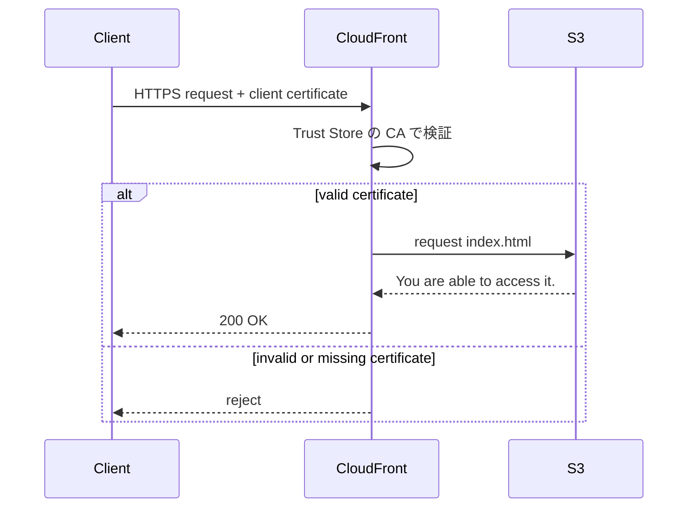

よ〜んです。

[前回の記事](/posts/eliminating-iam-access-keys-with-iam-roles-anywhere/)に引き続き、証明書関連の記事です。

今回は CloudFront の viewer mTLS を触ってみました。

CloudFront 側で mTLS を受けれるので「証明書を持っている人だけ入れる」みたいな入口を作れます、なかなか便利そうです。

ソースコードは[こちら](https://github.com/mu7889yoon/examples/tree/main/learn-about-mtls)です。

参考 [信頼は相互に: Amazon CloudFront が mTLS をサポート | Amazon Web Services ブログ](https://aws.amazon.com/jp/blogs/news/trust-goes-both-ways-amazon-cloudfront-now-supports-viewer-mtls/)

ソースコード [examples/learn-about-mtls at main · mu7889yoon/examples](https://github.com/mu7889yoon/examples/tree/main/learn-about-mtls)

## mTLS(相互TLS)

mTLS は Mutual TLS の略で「サーバーもクライアントも証明書で相手を確認する TLS」です。

普通の HTTPS では、ブラウザがサーバー証明書を確認します。
つまり「このサイトは本当にそのサイトなのか？」をクライアント側が検証する感じですね。

一方で mTLS では、サーバー側もクライアント証明書を確認します。



今回の検証では、ローカルで CA 証明書とクライアント証明書を作りました。
CloudFront には CA 証明書の bundle を Trust Store として登録して、クライアント証明書がその CA で署名されているかを見てもらう構成です。

参考 [mTLSとは？| 相互TLS | Cloudflare](https://www.cloudflare.com/ja-jp/learning/access-management/what-is-mutual-tls/)

## 今回の構成図

今回作った構成はこんな感じです。

```mermaid
architecture-beta
    group aws(logos:aws)[AWS Cloud]

    service user(internet)[User with client cert]
    service cf(logos:aws-cloudfront)[CloudFront viewer mTLS] in aws
    service site(logos:aws-s3)[Private S3 bucket] in aws
    service ts(logos:aws-certificate-manager)[CloudFront Trust Store] in aws
    service ca(logos:aws-s3)[CA bundle in S3] in aws

    user:R --> L:cf
    cf:R --> L:site
    ts:T --> B:cf
    ca:T --> B:ts
```



CDK 的には、主に以下を作っています。

`AWS::CloudFront::TrustStore` を作り、Distribution の `ViewerMtlsConfig` に Trust Store を紐づけました。

CloudFront の L2 construct にまだ直接の設定がない部分は、L1 の `CfnDistribution` に override しています。

```typescript
cfnDistribution.addPropertyOverride('DistributionConfig.ViewerMtlsConfig', {
  Mode: 'required',
  TrustStoreConfig: {
    TrustStoreId: trustStore.attrId,
    AdvertiseTrustStoreCaNames: true,
    IgnoreCertificateExpiry: false,
  },
});
```

実際に証明書なしでアクセスすると、CloudFront からクライアント証明書を要求されたあと、レスポンスを受け取れずに接続が閉じられました。


## 証明書の作成

サンプルコードを使用してくださっている方は`npm run deploy`で証明書の作成も行われます。


`client.p12`をダブルクリックするとキーチェーンアクセスが開きます。


再度、CloudFrontのページを開くと、このようなポップアップが表示されます。


無事アクセスできました。


## まとめ

固定 IP を持たないけどアクセス制限したいケースや、Cognitoなどを使えないけどアクセス制限したいケースとかに良さそうだと思いました。

家族とかにポータルサイトを提供する際には、こういう認証方式もいいなと思いました。

クライアント証明書をどう配るか、紛失時にどう失効するか、みたいな運用は別途考える必要がありますが、入口の仕組みとしてはかなりシンプルで好きです。

ではでは〜
