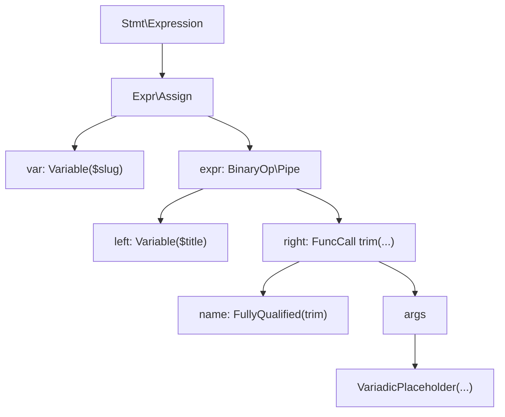

学生の頃に Elixir を少し触っていたので、PHPに[パイプ演算子](https://www.php.net/manual/ja/language.operators.functional.php) が入ると聞いてテンションが上がっている、よ〜んです。

パイプ演算子ってこんなやつです↓

```elixir
title = " PHP 8.5 Released "
slug = title
	|> String.trim()
	|> String.downcase()
	|> String.replace(" ", "-")
IO.puts(slug)
```

ネストした関数呼び出しを内側から読んでいくのではなく、値が順番に加工されていく様子をそのままコードにできる。

これが当時かなり衝撃でした。

そして、ついに PHP でもパイプ演算子が使えるようになったようです！！！

**「「「「「うれしい！！！」」」」」**

ということで今回は、PHP のパイプ演算子について触りつつ、どんな場面で使えるのかを考えてみます。

あと、せっかくなので構文木とかIR的にはどういう話なのかも見てみます。

## PHP のパイプ演算子

パイプ演算子は、左辺の値を右辺の [callable](https://www.php.net/manual/ja/language.types.callable.php) に渡すための演算子です。

たとえば、次のような文字列を加工するコードがあるとします。

```php
$title = ' PHP 8.5 Released ';
$slug = strtolower(str_replace(' ', '-', trim($title)));
echo($slug);
```

これは処理の流れに合わせて読むと、内側から順番に追う必要があります。

```txt
trim
  ↓
str_replace
  ↓
strtolower
```

なのですが、コード的にはこう見えます。

```php
strtolower(
    str_replace(
        ' ',
        '-',
        trim($title)
    )
);
```

実際に最初に評価されるのは一番内側の `trim($title)` です。

今となっては慣れましたが、読む向きと処理の向きがズレています。

最初に見たときはあまり直感的ではないなと思った部分です。

パイプ演算子を使うと、これを値の流れに近い形で書けます。

```php
$title = ' PHP 8.5 Released ';
$slug = $title
    |> trim(...)
    |> (fn (string $value) => str_replace(' ', '-', $value))
    |> strtolower(...);
```

### 木を見る

構文木を全部出すと大変なので、この部分に注目して見てみます。

```php
$slug = $title
    |> trim(...);
```

パイプは左辺と右辺を持つExpressionとして読めます。



### オペコードを見てみる

後述する理由でパイプのパターンはクロージャーを使用しているので当該部分を削除して比較します。
#### nested-wo-str_replace.php
```php
<?php
$title = ' PHP 8.5 Released ';
$slug = strtolower(trim($title));
echo($slug);
```

```sh
$_main:
     ; (lines=8, args=0, vars=2, tmps=1)
     ; (after optimizer)
     ; /app/nested-wo-str_replace.php:1-5
0000 ASSIGN CV0($title) string(" PHP 8.5 Released ")
0001 INIT_FCALL 1 96 string("strtolower")
0002 T2 = FRAMELESS_ICALL_1(trim) CV0($title)
0003 SEND_VAL T2 1
0004 V2 = DO_ICALL
0005 ASSIGN CV1($slug) V2
0006 ECHO CV1($slug)
0007 RETURN int(1)
php 8.5 released%   
```
#### pipe-wo-str_replace.php
```php
<?php
$title = ' PHP 8.5 Released ';
$slug = $title
	|> trim(...)
	|> strtolower(...);
echo($slug);
```

```sh
$_main:
     ; (lines=9, args=0, vars=2, tmps=2)
     ; (after optimizer)
     ; /app/pipe-wo-str_replace.php:1-7
0000 ASSIGN CV0($title) string(" PHP 8.5 Released ")
0001 T3 = QM_ASSIGN CV0($title)
0002 T2 = FRAMELESS_ICALL_1(trim) T3
0003 INIT_FCALL 1 96 string("strtolower")
0004 SEND_VAL T2 1
0005 V2 = DO_ICALL
0006 ASSIGN CV1($slug) V2
0007 ECHO CV1($slug)
0008 RETURN int(1)
LIVE RANGES:
     2: 0003 - 0004 (tmp/var)
php 8.5 released%    
```

#### diff
パイプを使用すると、`$title` を `QM_ASSIGN` でtmpに入れてから `trim` に渡していますね(緑文字)

一方で 従来のネストでは、`$title` をそのまま `trim` に渡しています(赤文字)

```diff
  ASSIGN CV0($title) string(" PHP 8.5 Released ")
- INIT_FCALL 1 96 string("strtolower")
- T2 = FRAMELESS_ICALL_1(trim) CV0($title)
+ T3 = QM_ASSIGN CV0($title)
+ T2 = FRAMELESS_ICALL_1(trim) T3
+ INIT_FCALL 1 96 string("strtolower")
  SEND_VAL T2 1
  V2 = DO_ICALL
  ASSIGN CV1($slug) V2
  ECHO CV1($slug)
  RETURN int(1)
```

### Elixir のパイプと同じ感じで書けるのか

答えはNoです

Elixir のパイプは、左側の値を次の関数呼び出しの第一引数として書けます。

```elixir
title = " PHP 8.5 Released "
slug = title
	|> String.trim()
	|> String.downcase()
	|> String.replace(" ", "-")
IO.puts(slug)
```

一方で、PHP のパイプは右側に callable を置きます。

```php
$value |> someFunction(...);
```

第二引数が必要な処理では、このように書けません

```php
// こういう感じでは書けない
$title
    |> str_replace(' ', '-');
```

そのため、クロージャーを書いてあげる必要があります。

```php
$title
    |> (fn (string $value) => str_replace(' ', '-', $value));
```

## Laravel でパイプを使うとしたら

まず思い浮かぶのは Collection です

```php
$names = collect($users)
		->map(fn ($user) => $user->name)
	    ->filter()
	    ->values();
```

Laravel の Collection は、もともと体験がかなり完成されてると思っています。
そのため、Collection の中では無理にパイプを使うことはなさそうです。

一方で、ControllerとUseCase間の処理はパイプが活躍しそうです。

たとえば、Controller の役割を

```txt
Request
  ↓
Validation
  ↓
UseCase / Action
  ↓
Resource / Response
```

という一本道のデータ変換として捉えると、

```php
public function store(StoreRequest $request, StoreAction $action)
{
	$validated = $request->validated();
	$article = $action(
		$validated['title'],
		$validated['body'],
		$request->user(),
	);
	return new ArticleResource($article);
}
```

```php
public function store(StoreRequest $request, StoreAction $action)
{
	return $request
			|> (fn (StoreRequest $request) => $request->validated())
			|> (fn (array $validated) => $action(
					$validated['title'],
					$validated['body'],
					$request->user(),
				))
			|> (fn (Article $article) => new ArticleResource($article));
}
```

のように、値の流れをそのままコードで表現できます。(あんま変わらんw)

逆に、UseCase の中には権限チェックやトランザクションなど副作用や分岐を伴う処理が多く存在します。そうした処理まで無理にパイプでつなぐより、命令的なコードの方が読みやすいと思います。

## まとめ

PHPのパイプを触ってみました、完成度は結構高いんじゃないかなと思います。

ですが、LaravelにおいてはCollectionやこの記事を執筆中に知ったPipelineとの住み分けも考えたいところです。

**「「「「「久しぶりにコードをかけて楽しかったです！！！！！！」」」」」**