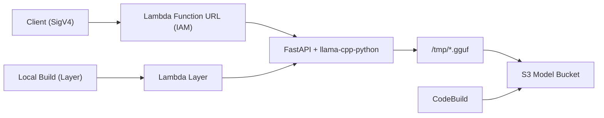

よ〜んです。

最近Lambdaを酷使するのにハマってて、タイムラインで話題だったQwen 3.5 4B Q4_K_MをLambdaで動かしてみました。

[サンプル実装](https://github.com/aws-samples/sample-chatbot-Lambda-SnapStart/)あるし、「すぐできるやろ」と思ってたんですが、意外とそうでもなかったので、ハマったポイントを残しておきます。

実装はこちらになります。[mu7889yoon/examples/qwen3.5b-on-lambda](https://github.com/mu7889yoon/examples/tree/main/qwen3.5b-on-lambda)

フォルダ名がtypoしているので、わかりにくいですが、**動いてるモデルは4B**です。

サンプル実装 [sample-chatbot-Lambda-SnapStart](https://github.com/aws-samples/sample-chatbot-Lambda-SnapStart/)

実装についてのブログ [Deploying AI models for inference with AWS Lambda using ZIP packaging](https://aws.amazon.com/jp/blogs/compute/deploying-ai-models-for-inference-with-aws-lambda-using-zip-packaging/)

## 構成

## 詰まったところ

### 1. `llama-cpp-python` のバージョン

> こちらは、ビルドやバージョンの問題なので、こんなことをせずにすぐ動くようになると思います。
> 2026/03/05 現在の解決方法です。

PyPI版をそのまま使うと、Qwen 3.5系の生成がうまく動きません。

一旦、Qwen 3.5 対応forkをローカルでビルドしています。

実装はここら辺を見てください。[mu7889yoon/examples/qwen3.5-on-lambda/src/layers/llama-cpp](https://github.com/mu7889yoon/examples/tree/main/qwen3.5b-on-lambda/src/layers/llama-cpp)

### 2. モデルのS3投入

最初は `BucketDeployment` でモデルをS3に置けば済むと思っていました。  
ただ、アップロードに時間がかかりすぎて現実的じゃなかったです。

なので、CodeBuildでモデルをダウンロードしてS3へ配置する方式に切り替えました。

## 呼び出してみる

エンドポイントを叩いてみます。

今回の本筋ではないので、これぐらいで

- 最初のトークンが返ってくるまで: 約4秒
- メモリ使用量: 約5600MiB

今回の本筋ではないので、これぐらいで

## まとめ

「コードを見てすぐできる」と思っていましたが、めちゃくちゃハマりました。

寒い時期になるとLLMでしんどくなりますね(卒業研究でCUDAとPyTorchに苦しめられた人間)

次回以降はJetsonとかでも動かしてみようと思います。ではー
