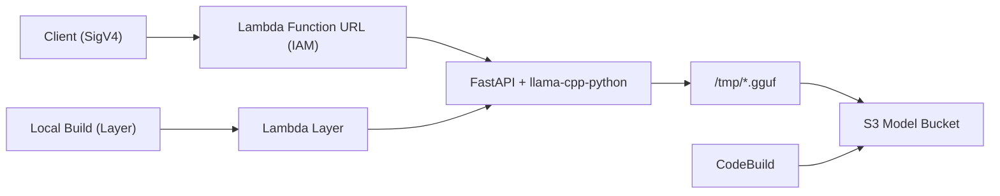

よ〜んです。

最近Lambdaを酷使するのにハマってて、タイムラインで話題だったQwen 3.5 9B Q4_K_MもLambdaで動かしてみました。

サンプルのソースコードもあるし、「すぐできるやろ」と思ってたんですが、意外とそうでもなかったので、ハマったポイントを残しておきます。

- [sample-chatbot-Lambda-SnapStart](https://github.com/aws-samples/sample-chatbot-Lambda-SnapStart/)
- [Deploying AI models for inference with AWS Lambda using ZIP packaging](https://aws.amazon.com/jp/blogs/compute/deploying-ai-models-for-inference-with-aws-lambda-using-zip-packaging/)

## 構成

## 詰まったところ

### 1. `llama-cpp-python` のバージョン

PyPI版をそのまま使うと、Qwen 3.5系の読み込みで詰まりました。  
ここは Qwen 3.5 対応forkをローカルでビルドしてLayer化するのが一番早かったです。

### 2. モデルのS3投入

最初は `BucketDeployment` でモデルをS3に置けば済むと思っていました。  
ただ、アップロードに時間がかかりすぎて現実的じゃなかったです。

なので、CodeBuildでモデルをダウンロードしてS3へ配置する方式に切り替えました。

## 呼び出してみる

エンドポイントを叩いて、SSEでレスポンスを受ける形で確認しました。

今回の計測メモはこんな感じです。

- 最初のトークンが返ってくるまで: 約4秒
- メモリ使用量: 約5600MiB

今回の本筋ではないので、これぐらいで

## まとめ

「コードを見てすぐできる」と思った割に、実際は細かいハマりどころが多かったです。  

個人的にはレスポンス時間を詰めつつ、次はJetsonとかでも動かしてみようと思います。
