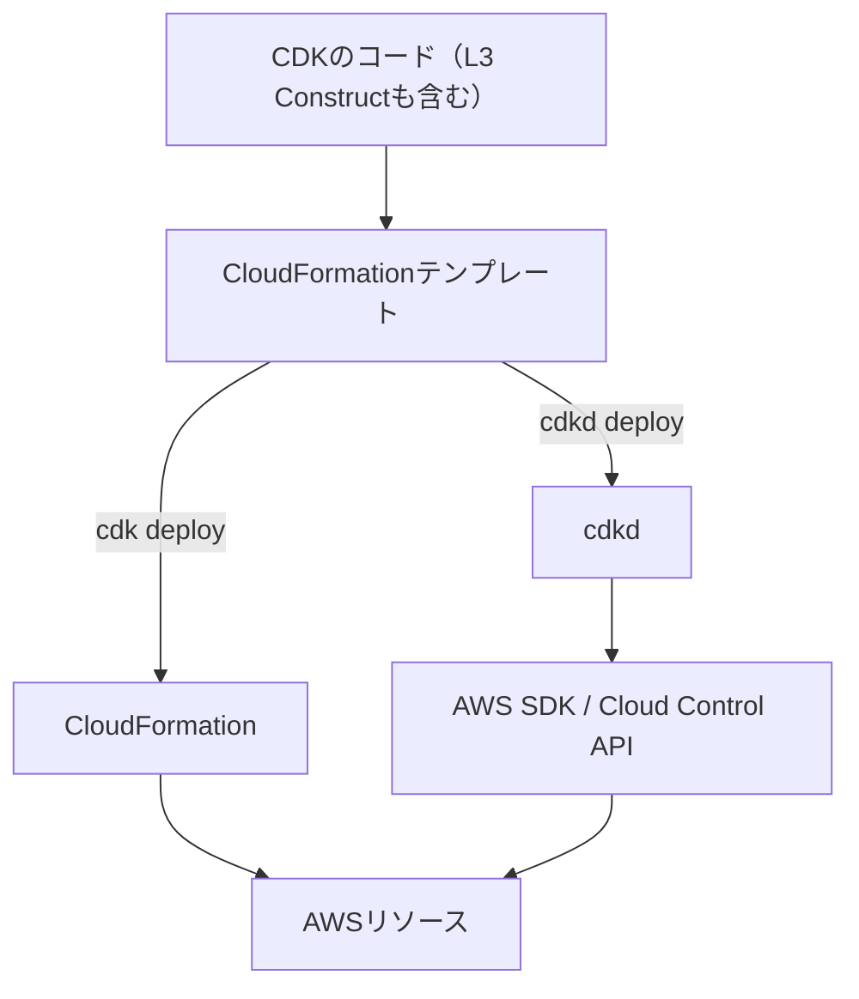

よ〜んです。

[前回の記事](https://mu7889yoon.github.io/posts/getting-start-with-spring-boot/)では、Spring BootでシンプルなTodoアプリを作りました。

今回は、そのアプリを動かすインフラをAWS CDKで書いて、[cdkd](https://github.com/go-to-k/cdkd)からデプロイしてみます。

気になっていたのは、普段のCDKと同じようにコードを書けるのか、特にL3 Constructもそのまま使えるのか、というところです。

## cdkd

cdkdはCDK Directの略で、AWS CDKのアプリケーションを、CloudFormationのスタック経由ではなくAWS SDKやCloud Control APIを使ってデプロイするツールです。

CDKのコードからCloudFormationテンプレートを生成し、それをもとにcdkdがリソースを作成・更新します。インフラを書くのはCDK、デプロイを担当するのはcdkd、という分担ですね。

同じCDKコードから生成したテンプレートを、どちらがデプロイするのかが変わります。流れを図にすると、こんな感じです。



図は[Core Concepts](https://github.com/go-to-k/cdkd/blob/v0.294.0/docs/concepts.md)をもとに、デプロイ経路の違いに絞って整理しています。

以下は、cdkdの公式READMEに掲載されているデプロイ比較のデモです。

<!--
画像保存・差し替え指示
挿入位置：この「cdkd」節の末尾。上の仕組みの図の後、「前回のアプリをAWSへ」の前。
対象画像：https://raw.githubusercontent.com/go-to-k/cdkd/main/assets/cdk-vs-cdkd.gif
この公式GIFを保存し、UUIDv7のファイル名で次の場所に配置してください。
保存先：static/images/01a0ff58-fdeb-750c-bfa9-e57b6e9560c2.gif
保存後、直下の画像行を次のMarkdownに差し替えてください。

GIFは静止画へ変換せず、そのまま保存してください。出典リンクは画像の下に残してください。
現在は外部URLで表示しています。リポジトリへの画像ファイルの保存はまだ行っていません。
-->


出典：[cdkd公式README](https://github.com/go-to-k/cdkd/blob/v0.294.0/README.md)

## 前回のアプリをAWSへ

前回作ったTodoアプリを、ALB付きのECS Fargateで動かし、Aurora PostgreSQL Serverless v2に接続する構成をCDKで書きました。

アプリの中身を作り直すのではなく、前回ローカルで動かしたものをAWSへ持っていく続きです。

コードは[examplesリポジトリ](https://github.com/mu7889yoon/examples/tree/main/getting-started-with-spring-boot-and-cdkd)に置いてあります。インフラ側には`aws-cdk-lib 2.272.0`、`cdkd 0.294.0`を使いました。

## L3 Construct

ALB付きFargateには、`ApplicationLoadBalancedFargateService`を使いました。

L3 Constructは、複数のリソースをよく使う構成としてまとめたものです。今回なら、ECSサービスやALBなどを一つのConstructから定義できます。

[実際のコード](https://github.com/mu7889yoon/examples/blob/main/getting-started-with-spring-boot-and-cdkd/infra/lib/todo-stack.ts)から、設定の一部を抜粋するとこんな感じです。

```typescript
const service = new ecsPatterns.ApplicationLoadBalancedFargateService(this, 'ApiService', {
  cluster,
  publicLoadBalancer: true,
  listenerPort: 80,
  assignPublicIp: true,
  cpu: 256,
  memoryLimitMiB: 512,
  // その他の設定は省略
});
```

ここは普段のCDKの書き方です。今回使ったFargateのL3 Constructは、cdkd専用の定義へ書き直すことなく利用できました。

L3でまとめて定義したリソースもデプロイできるのかが気になっていましたが、今回の`ApplicationLoadBalancedFargateService`ではできていますね。

## デプロイしてみる

`synth`でテンプレートを生成し、`diff`やdry-runで変更内容を確認して、`deploy`する流れです。今回のコードではnpm scriptsから呼び出しています。

```bash
npm run synth
npm run diff
npm run deploy:dry-run
npm run deploy
```

環境設定や初回のbootstrapについては、[インフラのREADME](https://github.com/mu7889yoon/examples/blob/main/getting-started-with-spring-boot-and-cdkd/infra/README.md)にまとめています。

デプロイ時には`--full-wait`を付けました。cdkdはデフォルトではECSサービスの安定状態まで待ちませんが、このオプションを付けるとそこまで待つようになります。

参考：[Wait Modes](https://github.com/go-to-k/cdkd/blob/v0.294.0/docs/wait-modes.md)

デプロイ後にアクセスすると、前回作ったTodo画面が表示されました。画面、ヘルスチェック、Todo APIでHTTP 200を確認できています。

## 感想

普段のCDKの書き方で構成を作り、L3 Constructで定義したALB付きFargateをcdkdからデプロイできました。

今回試したかったのは、まずこの流れです。速度比較まではしていませんが、CDKのConstructを使いながら、デプロイの仕組みを変えて試せるのは面白いですね。

前回作ったSpring BootのアプリをAWSで動かすところまで進められたので、一旦ここまでです。
